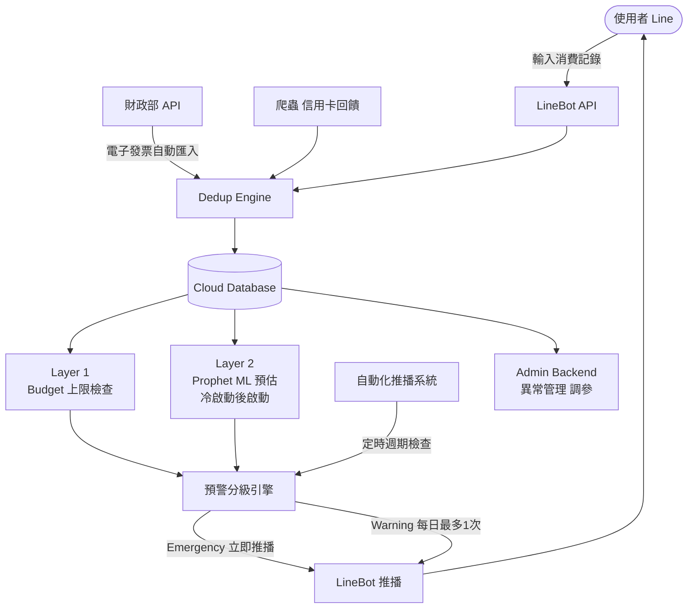

# 會議記錄 — 2026-03-25

**參與者：** 鄭弘煒（PM）、呂孰睿（Lead Design Engineer / V&V Engineer / Lead Ops & Maintenance Engineer）、李瑋晨（Lead Systems Architect / Lead QA/QC Engineer / Configuration Manager）、Claude（Chief/Lead Systems Engineer / Requirements Engineer / System Safety Engineer）

---

## 角色分配

| # | 角色 | 扮演者 |
|---|------|--------|
| 1 | Chief / Lead Systems Engineer (CSE) | Claude |
| 2 | Program / Project Manager | 鄭弘煒 |
| 3 | Requirements Engineer | Claude |
| 4 | Lead Systems Architect | 李瑋晨 |
| 5 | Lead Design Engineer | 呂孰睿 |
| 6 | Lead Production Engineer | 鄭弘煒 |
| 7 | V&V Engineer | 呂孰睿 |
| 8 | Lead Integration Engineer | 鄭弘煒 |
| 9 | Lead QA/QC Engineer | 李瑋晨 |
| 10 | Lead Ops & Maintenance Engineer | 呂孰睿 |
| 11 | System Safety Engineer | Claude |
| 12 | Configuration Manager | 李瑋晨 |
| 13 | User / End User Representative | 呂孰睿 |

---

## 一、成功定義（Mission Success Criterion）

> 系統成功引導使用者建立**健康的消費習慣**——
> 具體指標：使用者在連續使用 N 個發薪週期後，超支頻率下降，且消費結構趨於穩定。

---

## 二、運行情境（Scenarios）

### Scenario 1：月初大額支出型
使用者月初繳租金、學費等大筆固定支出，剩餘預算驟降。系統需判斷這是「正常支出」而非異常，並重新規劃剩餘週期的可用額度。

### Scenario 2：新鮮人財務茫然型
剛出社會，第一次拿到整筆薪水，不知道怎麼分配，需要系統引導建立消費結構。

### Scenario 3：理財入門誘因型
使用者看到「省下來的錢可以做什麼」——投資、累積資產——有正向誘因讓他願意控制消費。

### Scenario 4：月底危機型
使用者在發薪週期第 25 天，累積消費已達 budget 的 85%，ML 預測到發薪日前將 run out，系統觸發預警推播。

---

## 三、核心需求（MVP Requirements）

| ID | 需求描述 |
|----|----------|
| REQ-01 | 系統以使用者自訂發薪日為週期計算剩餘預算 |
| REQ-02 | 使用者 input 為 primary trigger，觸發 ML 運算、結果存回 DB、必要時推播通知 |
| REQ-03 | ML 預測若顯示週期結束前將超支，透過 LineBot 推播預警通知 |
| REQ-04 | False alarm 超過 N 次，自動暫停推播，後台管理員手動調參後可重新啟用 |
| REQ-05 | 費率或規則變更需於 30 天前公告通知使用者 |

**Phase 2（暫緩）：**
- 低配版生活建議（在剩餘預算內的消費計畫）

---

## 四、System Interface（系統交互）

| 外部系統 | 互動方式 | 方向 |
|----------|----------|------|
| Line Platform | LineBot API，推播通知 + 接收使用者輸入 | 雙向 |
| 財政部 API | 電子發票資料抓取 | 單向（流入） |
| Cloud DB | 資料儲存（Provider 待定：AWS / GCP / Azure） | 雙向 |
| Claude API | 自然語言分析 | 單向（呼叫） |
| Prophet / ML Engine | 超支預測 | 單向（呼叫） |
| 自動化推播系統 | 定時觸發通知（週期檢查、預警） | 單向（流出） |
| 爬蟲（信用卡回饋） | 抓取外部優惠資訊 | 單向（流入） |

---

## 五、系統規格與限制（Specifications & Constraints）

| 類別 | 項目 | 規格 |
|------|------|------|
| 通知政策 | 費率變更公告 | 異動前 30 天通知使用者 |
| 地區限制 | 服務範圍 | 僅限台灣用戶 |
| 貨幣 | 支援幣別 | 僅新台幣（TWD），不處理外幣換算 |
| Target Audience | 使用者條件 | 台灣用戶 ＋ 使用新台幣消費 ＋ 有 Line 帳號 ＋ 聯網手機 |
| 資料來源 | 信用卡回饋 | 爬蟲抓取（規則待定） |
| False Alarm 處理 | 每週期上限 | 每位使用者每個發薪週期最多 2 次預警；超過後停止推播給使用者 |
| False Alarm 超額 | 管理員介入 | 超額記錄僅顯示於管理員後台，系統通知管理員手動處理 |
| 參數調整 | 調參機制 | 後台管理員手動調參 |
| ML 冷啟動 | 啟動條件 | 15 個有消費記錄的交易日才啟動 ML 預估 |
| 無資料處理 | 主動詢問 | 若無消費記錄，系統主動詢問使用者確認串接狀況 |
| 預警頻率 | 每日上限 | 每天最多推播 1 次預警，無月上限 |
| 預警分級 | Emergency | 預測即將或已無餘額 → 緊急通知（不受一般限制） |
| 預警分級 | Warning | 消費趨勢異常、有超支風險 → 一般通知 |
| Safety | Miss > False Alarm | 寧可誤報，不可漏報超支風險 |
| Agent 邊界 | 投資建議 | 可主動通知投資建議，但不執行任何投資操作（建議權 ✓，執行權 ✗） |

---

## 六、CONOPS（Concept of Operations）

### 如何運作（How）

### 由誰操作（Who）

| 角色 | 操作內容 |
|------|----------|
| 使用者 | 透過 LineBot 輸入消費、設定發薪日、接收推播通知 |
| 財政部 API | 自動匯入電子發票資料（使用者授權後） |
| Claude Agent | 自動分析消費資料、產生投資建議通知 |
| Prophet ML | 自動預測週期內超支風險 |
| 管理員 | 透過 Admin Backend 監控異常、調整參數 |

### 運行週期（When）

| 時間點 | 系統行為 |
|--------|----------|
| 使用者輸入當下 | 觸發完整 pipeline（Dedup → DB → ML → 分級 → 推播） |
| 每天離峰時段 | 資料庫自動備份 |
| 發薪日 | 週期重置，預警次數歸零 |
| 冷啟動達標（第 15 交易日） | Layer 2 ML 預估自動啟動 |
| 無消費記錄時 | 系統主動詢問使用者確認串接狀況 |

---

## 七、Operational Requirements（運行需求）

### 為什麼需要這個系統（Why）

| ID | 需求 | 說明 |
|----|------|------|
| OR-01 | 幫助使用者避免超支 | 核心任務，miss 比 false alarm 更危險 |
| OR-02 | 引導建立健康消費習慣 | 成功定義：連續使用 N 個週期後超支頻率下降 |
| OR-03 | 提供理財入門誘因 | 讓使用者看到省錢可帶來投資成長的正向回饋 |
| OR-04 | 支援新鮮人建立財務結構 | 目標族群為剛出社會、不熟悉理財者 |

### 系統必須做到（Shall）

| ID | 需求 | 說明 |
|----|------|------|
| OR-05 | 以發薪日為週期計算預算 | 使用者自訂，非曆法月份 |
| OR-06 | 達到 ODD 資料條件後啟動 ML 預估 | 15 個有消費記錄的交易日 |
| OR-07 | 預警分級推播 | Emergency / Warning 兩級，每天最多 1 次（緊急不限） |
| OR-08 | 無消費記錄時主動詢問 | 確認串接狀況，避免資料盲區 |
| OR-09 | 提供投資建議通知 | 僅建議，不執行任何投資操作 |
| OR-10 | 異常使用者通知管理員 | 超過預警上限後轉由後台處理 |
| OR-11 | 費率變更提前 30 天公告 | 保障使用者知情權 |

### 系統不得做（Shall Not）

| ID | 限制 | 原因 |
|----|------|------|
| OR-12 | 不得自動執行投資 | 法規風險、liability |
| OR-13 | 不得處理外幣 | 超出 ODD 範圍 |
| OR-14 | 不得將使用者資料用於第三方 | 個資法 |
| OR-15 | 不得共享使用者折扣碼 | 法律風險 |

---

## 八、Operational Design Domain (ODD)

### 1. 地理與環境條件
| 參數 | 定義 |
|------|------|
| 服務地區 | 僅限台灣 |
| 貨幣 | 僅新台幣（TWD） |
| 法規框架 | 中華民國個資法、財政部電子發票規範 |

### 2. 使用者條件
| 參數 | 定義 |
|------|------|
| 必要設備 | 聯網手機 |
| 必要帳號 | Line 帳號 |
| 目標族群 | 台灣用戶，使用新台幣消費（新鮮人、剛出社會者為主） |
| 排除族群 | 無 Line 帳號者、外幣消費為主者 |

### 3. 資料條件
| 參數 | 定義 |
|------|------|
| 資料來源 | 使用者手動輸入 ＋ 財政部電子發票 API |
| ML 啟動條件 | 15 個有消費記錄的交易日 |
| 冷啟動行為 | ML 未啟動期間僅執行 Layer 1（Budget 上限預警） |
| 無資料處理 | 主動詢問使用者確認串接狀況 |
| 重複資料 | 手動輸入與 API 可能重疊，需 dedup 機制 |

### 4. 運行條件
| 參數 | 定義 |
|------|------|
| 時間週期 | 使用者自訂發薪日為週期起點 |
| 預警頻率 | 每天最多 1 次 |
| 預警等級 | Emergency（即將無餘額）/ Warning（有超支風險） |
| 緊急通知 | 不受每日 1 次限制 |
| 管理員介入 | 異常使用者由後台通知管理員手動處理 |

### 5. 系統邊界（Out of Scope）
| 排除項目 | 原因 |
|----------|------|
| 外幣處理 | 超出設計範圍 |
| 自動執行投資 | 法規風險、liability |
| 真人理財專員 | 非 AI 自動化設計理念 |
| 折扣碼交互套用 | 法律風險 |
| 系統收費 | 影響資料量與資源共享 |

---

## 九、Configuration Management

| 項目 | 決定 |
|------|------|
| 環境 | Staging / Production 分開，多版本並存 |
| 測試資料 | 實際資料 ＋ 虛構資料並行測試 |
| 發布條件 | 所有測試條件通過後才 publish |
| 版本紀錄 | 內部 documentation 記錄版本歷程與變更 |

---

## 十、QA/QC 標準

### 使用者分類
| 類別 | 定義 |
|------|------|
| 危險消費習慣 | 超支頻率高、預警次數多 |
| 一般用戶 | 消費在預算範圍內，習慣穩定 |

### 成功評估標準
| 指標 | 說明 |
|------|------|
| 消費習慣改善 | 使用者分類從「危險」移動到「一般」 |
| 預警次數下降 | 連續週期預警觸發次數減少 |

### ML 預測品質標準
| 項目 | 標準 |
|------|------|
| 預測合格範圍 | 預測值落在使用者薪水 ±5% 內為合格 |
| 超出範圍處理 | 預測信心度降低，避免對新使用者發出不準確預警 |

---

## 十一、系統安全與可靠性架構（Non-Functional Requirements）

| 類別 | 項目 | 說明 |
|------|------|------|
| **API Security** | Rate Limit | 各 endpoint 獨立限制，分開計算 |
| **API Security** | Claude API Token | 每位使用者上限 1000～2000 tokens（收費資源，需控管） |
| **API Security** | Emergency 豁免 | 緊急預警不走 Claude API，由規則引擎直接觸發，不受 token 上限影響 |
| **API Security** | 外部 API（財政部、Line） | 依對方規範，不在系統控制範圍內 |
| **API Security** | 財政部 API | 需使用者授權 token，定期 refresh |
| **API Security** | Line Webhook | 驗證來源合法性（signature verification） |
| **Data Security** | 資料加密 | 使用者消費資料靜態加密（at rest） |
| **Data Security** | 傳輸加密 | HTTPS / TLS |
| **Database** | 備份策略 | 每天離峰時段自動備份，保留期限待定 |
| **Database** | HA | Active-Standby（成本考量，MVP 階段適用） |
| **System** | Failover | Cloud provider 多區域部署 |

---

## 十二、V&V 策略

### Verification（我們蓋對了嗎）

| 方法 | 說明 |
|------|------|
| Unit Test | 每個元件獨立測試（預算計算、分級邏輯、推播觸發） |
| Integration Test | LineBot → Core System → DB → 推播整條流程跑通 |
| ML Validation | 用歷史資料 back-test，確認預測值落在薪水 ±5% 內 |
| Staging 環境 | 用虛構資料 ＋ 部分真實資料跑，對齊 production 行為 |

### Validation（我們蓋了對的東西嗎）

| 方法 | 說明 |
|------|------|
| 使用者分類追蹤 | 定期檢查危險 → 一般的轉移率 |
| 預警次數趨勢 | 每個週期統計，看是否有下降趨勢 |
| 使用者問卷 | N 個週期後詢問使用者對財務掌控感的主觀評分 |
| A/B Test | 不同預警策略對消費行為的影響（Phase 2） |

### Staging vs Production 對齊原則
虛構資料必須涵蓋所有邊界條件 test case：
- 月初大額支出
- 冷啟動（第 15 天剛達標）
- 連續無輸入
- Emergency 觸發
- False Alarm 上限達標

---

## 十三、❌ 捨棄選項（Design Decision Record）

| 捨棄項目 | 原因 |
|----------|------|
| 真人理財專員 | 本系統定位為 AI 自動化，真人介入不符合核心設計理念 |
| 折扣碼自動交互套用 | 使用者之間共享折扣碼可能違反商家使用條款及相關法規，法律風險過高 |
| 系統收費制 | 收費降低使用者數量，導致可訓練資料不足；違反資源共享理念，影響 ML 模型品質 |
| 自動執行投資 | 需金融業執照，有法規風險與 liability 問題；系統僅提供投資建議，不代為操作 |

---

## 十四、待辦事項

- [x] 確認 False Alarm 暫停門檻 N 值（= 2 次／發薪週期）
- [ ] 確認 Cloud DB Provider（AWS / GCP / Azure）
- [ ] 評估財政部 API 申請流程與資料延遲問題
- [ ] 定義爬蟲信用卡回饋的法律可行性
- [ ] 設計後台 admin dashboard 規格（調參介面）
- [ ] Phase 2 低配版生活建議功能規劃
- [x] 確認資料庫備份頻率（每天離峰時段）
- [x] 確認 HA 架構（Active-Standby）
- [ ] 確認備份資料保留期限
- [x] 確認 Claude API Token 上限（1000～2000 tokens／使用者）
- [ ] 確認各 endpoint Rate Limit 細部數值
